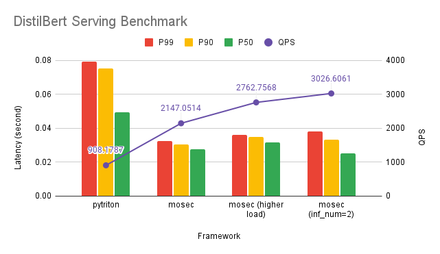

## HTTP load test tool

- [hey](https://github.com/rakyll/hey)

## Script

### Bert

- mosec
  - `hey -m POST -n 50000 -d "The quick brown fox jumps over the lazy dog" http://127.0.0.1:8000/inference`
- pytriton
  - `hey -m POST -n 50000 -H Inference-Header-Content-Length:175 -D bert.bin http://127.0.0.1:8000/v2/models/distilbert/infer`

This binary file is generated by `pytriton` client:

```python
b'{"id":"0","inputs":[{"name":"messages","shape":[1,1],"datatype":"BYTES","parameters":{"binary_data_size":47}}],"outputs":[{"name":"labels","parameters":{"binary_data":true}}]}+\x00\x00\x00The quick brown fox jumps over the lazy dog'
```



Check the [result](./results/bert.md) for more details.
